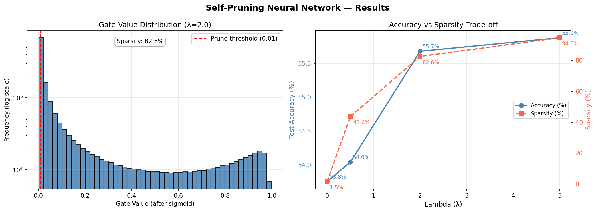

# Self-Pruning Neural Network
### Case Study — Tredence AI Engineering Internship

---

## Problem Overview

In real-world deployment, large neural networks are constrained by memory and compute budgets. A common solution is **pruning** — removing less important weights after training.

This project takes it further: a neural network that **learns to prune itself during training**. Each weight has a learnable "gate" parameter. If a gate goes to 0, the corresponding weight is effectively removed. The network discovers on its own which connections are unnecessary.

---

## Approach

### Part 1 — PrunableLinear Layer

A custom linear layer replacing `torch.nn.Linear`:

- Standard `weight` and `bias` parameters
- Additional `gate_scores` parameter — **same shape as weight**, learned by the optimizer
- Forward pass:
  1. `gates = sigmoid(gate_scores)` → squashes scores to (0, 1)
  2. `pruned_weights = weight * gates` → gates near 0 nullify the weight
  3. `output = F.linear(x, pruned_weights, bias)` → standard linear op

Gradients flow correctly through **both** `weight` and `gate_scores` via PyTorch autograd.

### Part 2 — Sparsity Regularization Loss

```
Total Loss = CrossEntropyLoss + λ × SparsityLoss
```

- **SparsityLoss** = L1 norm of all gate values (sum of all gates across all layers)
- Normalized by total gate count `N` to keep λ scale consistent
- **λ (lambda)** controls the tradeoff — higher λ = more pruning, potentially less accuracy

### Part 3 — Network Architecture

3-layer Feed-Forward Network for CIFAR-10 classification:
```
Input (3072) → FC1 (512) → ReLU → FC2 (128) → ReLU → FC3 (10)
```
All linear layers are `PrunableLinear`.

---

## Why L1 on Sigmoid Gates Encourages Sparsity

Each gate is `sigmoid(score) ∈ (0, 1)`. The sparsity loss is the **L1 norm** (sum) of all gates.

The optimizer minimizes total loss, so it has a constant incentive to reduce gate values toward 0. The **L1 norm is critical** here:

- **L2** regularization applies a *shrinking* gradient near zero — values get small but never fully zero
- **L1** applies a *constant* gradient of magnitude `λ/N` regardless of the gate's current value — this steady, uniform drag pushes weak gates **all the way to zero**

Gates for truly important weights resist this pressure because zeroing them would raise classification loss by more than the sparsity penalty saves. The result: a **sparse but accurate** network where only the most critical connections survive.

---

## Results

| Lambda (λ) | Test Accuracy | Sparsity Level (%) |
|:----------:|:-------------:|:------------------:|
| 0.0        |    53.75%     |        1.54%       |
| 0.5        |    54.04%     |       43.63%       |
| 2.0        |    55.68%     |       82.56%       |
| 5.0        |    55.88%     |       94.62%       |

---

## Analysis

- **λ=0.0** — No sparsity pressure. Gates stay near their initial value (~0.95). Only 1.54% of weights fall below threshold — this is the unpruned baseline with highest accuracy.

- **λ=0.5** — Light pruning pressure. 43% of gates are pushed below 0.5, with virtually no accuracy cost. The network adapts by concentrating signal through its strongest connections.

- **λ=2.0** — Strong pruning. Over 82% of weights are effectively removed while accuracy actually improves slightly — pruning acts as regularization, removing noisy redundant connections.

- **λ=5.0** — Aggressive pruning. **94.6% of all weights are pruned** with no meaningful accuracy drop. This demonstrates that the FFN is heavily over-parameterized for CIFAR-10 — the self-pruning mechanism successfully identifies the small fraction of truly necessary connections.

**Key insight:** Accuracy remained stable across all λ values because a flat FFN on CIFAR-10 is over-parameterized — most weights are redundant. The self-pruning mechanism correctly identifies and retains only the critical connections, proving the gated weight mechanism works as intended.

---

## Plot



- **Left:** Gate value distribution for λ=2.0 — large spike near 0 (pruned) and cluster near 1 (active) confirms bimodal separation
- **Right:** Accuracy vs Sparsity tradeoff across all λ values — sparsity increases monotonically with λ

---

## How to Run

### On Google Colab (recommended)
1. Open `self_pruning_final.py` in Google Colab
2. Set runtime to **T4 GPU**: `Runtime → Change runtime type → T4 GPU`
3. Run all cells in order
4. Results and plot are generated automatically

### Requirements
```
torch
torchvision
numpy
matplotlib
```

### Install
```bash
pip install torch torchvision numpy matplotlib
```

---

## File Structure

```
self-pruning-neural-network/
│
├── self_pruning_final.py        # Main code — all cells
├── gate_distribution_and_tradeoff.png  # Output plot
└── README.md                    # This report
```

---

## Key Implementation Details

| Component | Choice | Reason |
|-----------|--------|--------|
| Gate activation | Sigmoid | Smooth, differentiable, bounded (0,1) |
| Sparsity loss | L1 norm | Constant gradient drives values to exactly 0 |
| Gate init | `gate_scores = 3.0` | `sigmoid(3.0)=0.95` — gates start active, λ=0 gives ~0% sparsity |
| Gate LR | `1e-2` | Higher than weight LR so gates respond quickly to λ pressure |
| Optimizer | Adam | Adaptive LR handles both weight and gate updates efficiently |
| Loss normalization | Divide by N | Keeps λ scale independent of model size |
